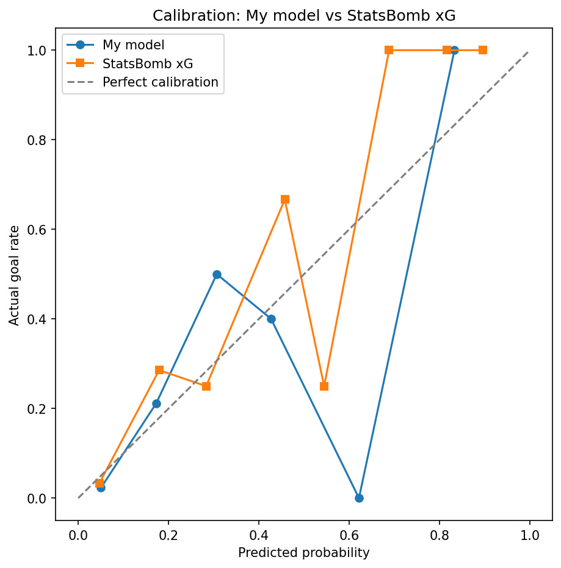

# xG Model — StatsBomb World Cup 2022

Building an Expected Goals (xG) model from scratch using StatsBomb's
free event and freeze-frame data from the 2022 World Cup.

## Current status

Built an 11-feature shot dataset combining shot geometry (distance,
angle to goal) with freeze-frame-derived defensive context (defenders
in the shot-to-goal triangle, distance to nearest defender, goalkeeper
positioning) and event tags (under pressure, one-on-one, open goal,
counter-attack).

Trained a baseline logistic regression and benchmarked it directly
against StatsBomb's own published xG on the same held-out shots:

| Metric    | My model | StatsBomb xG |
|-----------|----------|--------------|
| Log loss  | 0.2470   | 0.2428       |
| ROC AUC   | 0.8664   | 0.8542       |

## Next steps
- Gradient boosting model (XGBoost/LightGBM) as a stronger baseline
- Expand training data beyond a single tournament
- Investigate multicollinearity between distance/angle features
  (correlation of -0.75)
