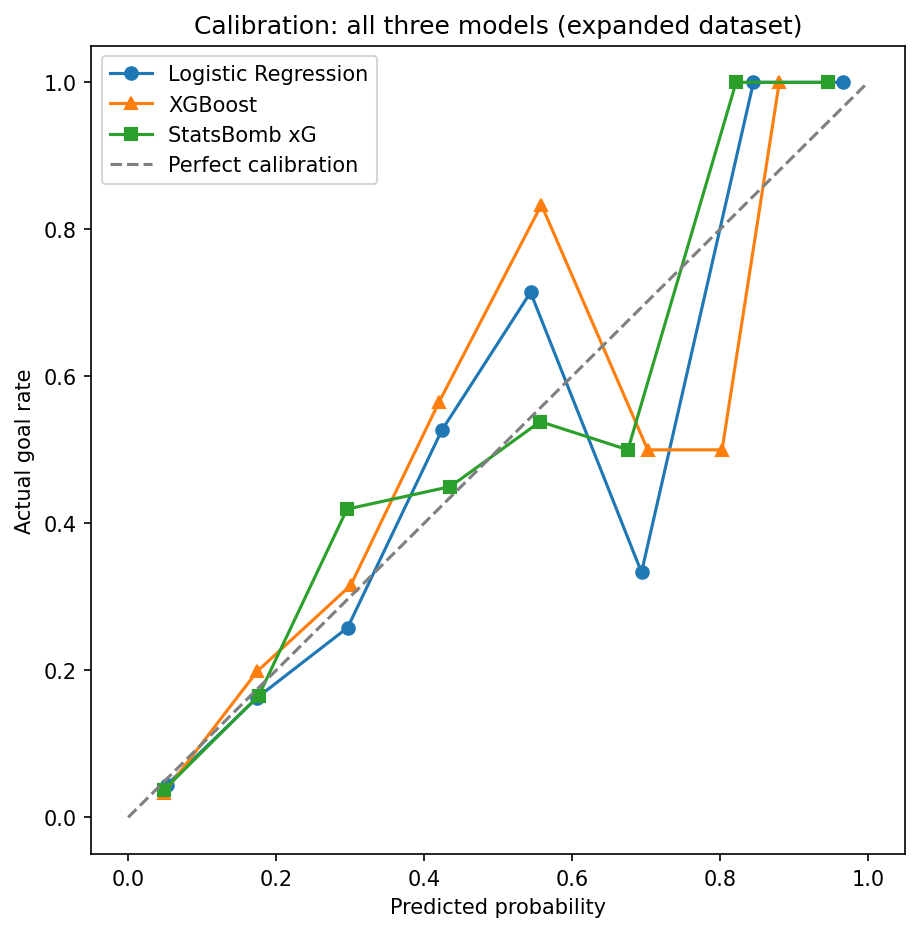

# Expected Goals (xG) Model - Built from StatsBomb Open Data

An Expected Goals (xG) model built from scratch using StatsBomb's free event and freeze-frame data, benchmarked directly against StatsBomb's own published xG values.

## Why xG, and why this project

xG is the foundational metric in modern football analytics, it estimates the probability that a given shot results in a goal, based on where it was taken from and the circumstances around it.
Every club's analytics department and most broadcasters now use some version of it. With the 2026 World Cup having just taken place, this felt like a good moment to build one properly from first principles rather than just using an existing library, in order to actually understand what goes into it.

The goal wasn't just to produce a working model, but to see how close a small, carefully-engineered feature set could get to a production model built by a company with more data and resources, and to document the reasoning behind every modelling decision along the way.

## Data

- Source: [StatsBomb Open Data](https://github.com/statsbomb/open-data), accessed via the 'statsbombpy' package
- Competitions used: World Cup 2018 & 2022, Euros 2020 & 2024, 230 matches, 5609 shots
- Penalty shootout kicks excluded as no representative open-play shot events, no defensive setup, different pressure context
- Penalties excluded from model training specifically, since StatsBomb doesn't provide freeze-frame data for them (78 shots affected).

## Features

11 features across three categories:

**Shot geometry**
- 'distance_to_goal' - Euclidean distance from shot location to goal centre
- 'angle_to_goal' - angle subtended by the goal mouth from the shot location (vector dot product method), which captured how much of the goal is actually visible/reachable, not just how far away the shot was

**Freeze-frame-derived (defensive context)**
- 'defenders_in_triangle' - number of opposition players inside the triangle formed by the shooter and the two goalposts (point-in-triangle geometric test)
- 'dist_to_nearest_defender' - proximity of the nearest opponent
- 'gk_dist_to_line' - how far the goalkeeper was off their goal line
- 'gk_y_offset' - how far off-centre the goalkeeper was positioned

**Event context** (StatsBomb tags)
- 'under_pressure', 'shot_open_goal', 'shot_first_time', 'shot_one_on_one', 'is_counter_attack'

The freeze-frame features are the differentiator as most public xG tutorials only have access to shot location as opposed to player positioning at the moment of the shot.
Having this data made it possible to build genuinely competitive defensive context features rather than relying on distance and angle alone.

## Methodology

- Logistic regression baseline and an XGBoost model
- Train/test split grouped by 'match_id', so shots from the same match never span both sets (avoids leakage from correlated in-match context)
- 5-fold grouped cross-validation, for a more robust comparison than a single split
- Evaluated on log loss and Brier Score and ROC AUC, deliberately not accuracy, since goals are rare (approx. 12-13% of shots) and accuracy is a misleading metric for this kind of problem.

## Results

**Single train/test split:**

| Model | Log loss | AUC |
|---|---|---|
| Logistic Regression | 0.2352 | 0.8161 |
| XGBoost | 0.2282 | 0.8296 |
| StatsBomb xG | 0.2227 | 0.8440 |

**5-fold cross-validation (logistic regression vs XGBoost):**

| Model | Log loss (mean ± std) |
|---|---|
| Logistic Regression | 0.2568 ± 0.0123 |
| XGBoost | 0.2590 ± 0.0166 |

The single split suggested XGBoost was clearly ahead. However, cross-validation told a different story: the two models are statistically indistinguishable, with overlapping standard deviations. I am treating the cross-validation as the more trustworthy result as it is a direct demonstration of why single-split evaluation can be misleading, especially on a dataset this size (5609 shots).

Both models land within a reasonable distance of StatsBomb's own xG, built with considerably more data and engineering resources. Given this project was built in a handful of evening sessions using an openly documented feature set, that gap felt like a reasonable place to stop for now.

All three models are well calibrated at the low end of the probability range (0-0.3), where large majority of shots sit, and cluster tightly near perfect calibration at the high end (0.8-1.0), though these bins contain few shots each. The middle range (0.3-0.7) is noisier for all three models, notably, all three show a dip around predicted probability ~0.68, where actual conversion undershoots the diagonal. Since this dip appears in StatsBomb's own xG as well as both of mine, it likely reflects something genuinely difficult about that particular bucket of shots rather than a flaw specific to my models.

## What I learned

**Multicollinearity between distance and angle.** 'angle_to_goal' showed a strong, clean relationship with conversion rate on its own (6% to 67% across angle buckets), but had a near-zero coefficient in the combined logistic regression. Checking the correlation between 'distance_to_goal' and 'angle_to_goal' showed a strong negative relationship (-0.75), closer shots reliably have wider angles. With both features in the same linear model, most of that shared signal gets attributed to distance, leaving angle's own coefficient small despite being independently predictive. However, this was not the case with XGBoost, seeing 'angle_to_goal' as the most important feature alongside distance in 5th, marking both as important for the model.

**A goalkeeper feature that didn't behave as expected.** 'gk_y_offset' (how far off-centre the keeper was) came out with a negative coefficient in the model, the opposite of the expected direction. Bucketing shots by this feature showed the expected positive trend across most of the range, but the most extreme bucket had very few shots and collapsed to a 0% conversion rate, likely dragging the overall coefficient in the wrong direction. Likely compounded by correlation with 'gk_dist_to_line', a related feature capturing similar information.

**Single-split evaluation can mislead.** Covered above under Results, however worth restating here as a standalone lesson, since it changed my actual conclusion about which model was 'better'.

**Feature importance largely agreed between models, with three notable exceptions.** Logistic regression and XGBoost ranked most features similarly: open goal, pressure, defenders in the triangle, first-time shots, and both goalkeeper features all landed within a rank or two of each other. Three features differed sharply:

- 'angle_to_goal' - last in logistic regression (rank 11), first in XGBoost (rank 1). Consistent with the distance/angle multicollinearity already discussed: a linear model cannot split credit between two correlated features the way a tree-based model can.
- 'shot_one_on_one' - 2nd in logistic regression, 9th in XGBoost
- 'is_counter_attack' - 4th in logistic regression, last in XGBoost

My understanding: these two boolean tags tend to co-occur with the geometric and freeze-frame feature already in the model (a one-on-one almost always also means few defenders nearby and a keeper off their line). XGBoost's tree splits can absorb that overlapping signal through the more granular features, while logistic regression, being purely linear, cannot redistribute credit the same way and ends up wighting the direct tag more heavily.

## Limitations

- Penalties excluded from modelling due to missing freeze-frame data
- Men's competitions only as women's football has different shot and conversion distributions and would need separate treatment
- 4 competitions - a small dataset by xG-model standards. XGBoost's relative performance improved as data grew from ~1,450 to ~5,609 shots, suggesting it would likely pull further ahead with significantly more data.  

## Project structure

xg-model/
├── notebooks/ — exploration and modelling notebooks, numbered in order
├── src/ — reusable feature engineering and data loading functions
├── notes/journal.md — working notes and session-by-session decisions
├── reports/ — saved plots
└── requirements.txt

## Next steps

- Learning curve analysis - train both models on increasing subsets of data to directly test whether XGBoost's relative performance keeps improving with scale. The feature importance comparison already hints this might pay off: XGBoost is capturing structure that logistic regression structurally cannot, even though this hasn't yet translated into a clear log loss advantage.  
- Player-level finishing analysis (over/underperformance vs xG)
- Small deployed demo (Streamlit) for interactive shot probability
